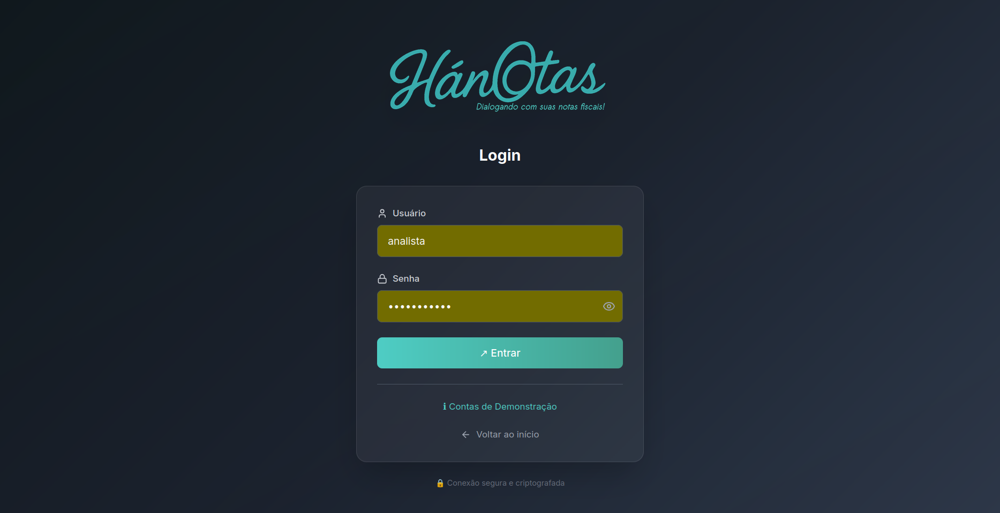
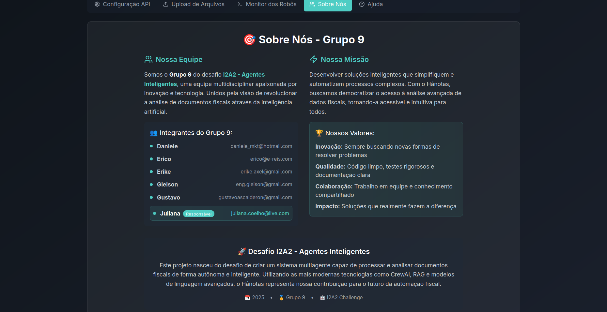
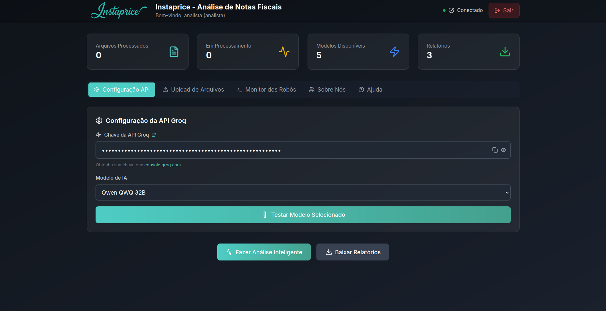
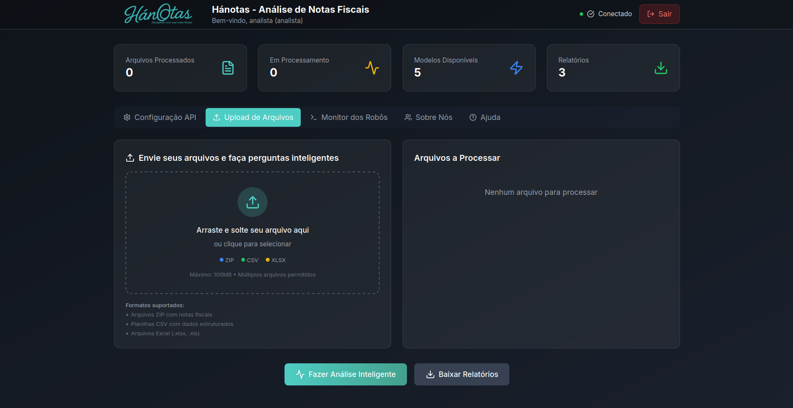
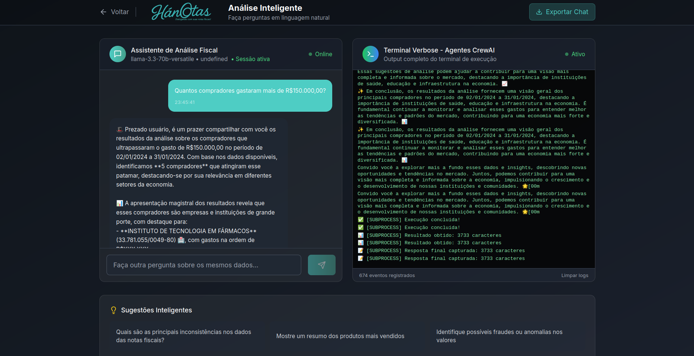
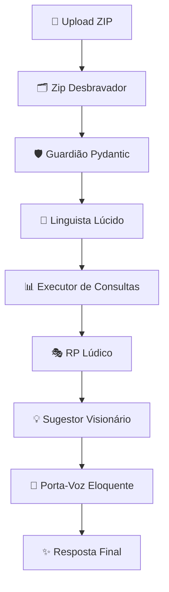

# 🎯 Instaprice - Sistema Inteligente de Análise Fiscal

<div align="center">


[](https://crewai.com/)
[](https://reactjs.org/)
[](https://fastapi.tiangolo.com/)
[](https://python.org/)
[](./LICENSE)

**Sistema multi-agente de análise inteligente de notas fiscais brasileiras**  
*Desenvolvido pelo Grupo 9 para o Desafio I2A2 - Agentes Inteligentes 2025*

[📸 Screenshots](#-screenshots) • [🚀 Quick Start](#-quick-start) • [🏗️ Arquitetura](#️-arquitetura) • [📖 Documentação](#-documentação) • [👥 Equipe](#-equipe)

</div>

---

## 🌟 **Sobre o Projeto**

O **Instaprice** é um sistema inovador que utiliza **7 agentes de IA especializados** para processar e analisar documentos fiscais brasileiros de forma autônoma e inteligente. Desenvolvido com tecnologias modernas como **CrewAI**, **React** e **FastAPI**, oferece uma interface intuitiva para extrair insights valiosos de notas fiscais.

### ✨ **Principais Funcionalidades**

- 🤖 **7 Agentes Especializados** trabalhando em sequência otimizada
- 📤 **Upload Inteligente** com drag & drop para ZIP, CSV e Excel
- 💬 **Perguntas em Linguagem Natural** - "Quais os maiores fornecedores?"
- 📊 **Análises Inteligentes** com dados reais (empresas, CNPJs, valores)
- 🎭 **Respostas Humanizadas** com formatação e emojis
- 💡 **Sugestões Automáticas** para novas análises
- 📱 **Interface Moderna** responsiva e intuitiva
- 🔄 **Processamento em Tempo Real** com terminal verbose integrado
- 📄 **Exportação em PDF** de conversas completas

---

## 📸 **Screenshots**

<div align="center">

### 🔐 **Tela de Login Elegante**


### 👥 **Sobre Nossa Equipe - Grupo 9**


### 💡 **Central de Ajuda Integrada**


### ⚙️ **Configuração Avançada de API**


### 📁 **Interface de Upload Intuitiva**


### 🤖 **Interface de diálogo com suas notas fiscais**


</div>

---

## 🚀 **Quick Start**

### 📋 **Pré-requisitos**

- **Python 3.11+** 
- **Node.js 18+** 
- **Chave API Groq** ([obter aqui](https://console.groq.com))

### ⚡ **Instalação Rápida**

```bash
# 1. Clone o repositório
git clone https://github.com/forensicpython/Grupo-9---I2A2.git
cd Grupo-9---I2A2

# 2. Configure o Backend
cd backend
pip install -r requirements.txt
cp .env.example .env
# Edite .env e adicione sua GROQ_API_KEY

# 3. Configure o Frontend
cd ../frontend
npm install

# 4. Execute o Sistema
# Terminal 1 - Backend
cd backend && python server.py

# Terminal 2 - Frontend  
cd frontend && npm run dev

# 5. Acesse o Sistema
# Frontend: http://localhost:5173
# API: http://localhost:8000
# Docs: http://localhost:8000/docs
```

### 🔧 **Configuração (.env)**

```bash
# Obrigatório
GROQ_API_KEY=gsk_sua_chave_groq_aqui

# Opcional
MODEL=llama-3.1-8b-instant
LOG_LEVEL=INFO
MAX_TOKENS=3000
TEMPERATURE=0.1
```

---

## 🏗️ **Arquitetura**

### 📊 **Fluxo de Dados**



### 🤖 **Os 7 Agentes Especializados**

| # | Agente | Função | Tecnologia |
|---|--------|--------|------------|
| 1️⃣ | **🗂️ Zip Desbravador** | Extrai arquivos comprimidos | Python + zipfile |
| 2️⃣ | **🛡️ Guardião Pydantic** | Valida dados dos CSVs | Pydantic Models |
| 3️⃣ | **🧠 Linguista Lúcido** | Interpreta perguntas em linguagem natural | RAG + Embeddings |
| 4️⃣ | **📊 Executor de Consultas** | Executa análises Pandas | Pandas + NumPy |
| 5️⃣ | **🎭 RP Lúdico** | Humaniza respostas técnicas | NLP + Formatting |
| 6️⃣ | **💡 Sugestor Visionário** | Gera sugestões inteligentes | AI + Context Analysis |
| 7️⃣ | **🎩 Porta-Voz Eloquente** | Consolida resposta final magistral | Multi-Agent Orchestration |

### 🏭 **Stack Tecnológico**

#### **Backend**
- **🐍 Python 3.11+** - Linguagem principal
- **🤖 CrewAI** - Framework multi-agente
- **⚡ FastAPI** - API moderna e rápida
- **🛡️ Pydantic** - Validação de dados
- **📊 Pandas** - Análise de dados
- **🔍 Sentence Transformers** - Embeddings semânticos
- **🌐 WebSocket** - Comunicação em tempo real

#### **Frontend**
- **⚛️ React 19** - Interface de usuário
- **🎨 Tailwind CSS** - Estilização moderna
- **⚡ Vite** - Build tool rápido
- **🔌 Axios** - Cliente HTTP
- **📄 jsPDF** - Geração de PDFs
- **🔗 WebSocket** - Logs em tempo real

#### **DevOps & Ferramentas**
- **🐳 Docker** - Containerização
- **📝 ESLint + Prettier** - Code quality
- **🧪 Pytest** - Testes backend
- **🔍 Jest** - Testes frontend

---

## 📖 **Documentação**

### 🎯 **Como Usar**

1. **🔐 Login**: Acesse com suas credenciais ou use conta de demonstração
2. **⚙️ Configure**: Adicione sua chave API Groq e selecione o modelo (ex: Qwen QWQ 32B)
3. **📤 Upload**: Envie um arquivo ZIP com CSVs de notas fiscais
4. **💬 Pergunte**: Digite sua pergunta em linguagem natural
5. **👀 Monitore**: Acompanhe o processamento no terminal verbose integrado
6. **📊 Analise**: Receba insights detalhados e sugestões inteligentes
7. **📄 Exporte**: Baixe o relatório completo em PDF

### 📝 **Exemplos de Perguntas**

```bash
"Quais os 5 maiores fornecedores por valor total?"
"Qual o valor médio das notas fiscais em janeiro?"
"Mostre a distribuição de vendas por estado"
"Identifique possíveis anomalias nos valores"
"Compare os produtos mais vendidos"
"Análise temporal das vendas por trimestre"
```

### 🎨 **Formato dos Dados**

#### **Formatos Suportados:**
- **📁 Arquivos ZIP** com notas fiscais (máximo 100MB)
- **📊 Planilhas CSV** com dados estruturados  
- **📈 Arquivos Excel** (.xlsx, .xls)
- **🔄 Múltiplos arquivos** permitidos

#### **Estrutura Esperada do ZIP:**
```
📁 notas_fiscais.zip
├── 📄 202401_NFs_Cabecalho.csv    # Dados dos cabeçalhos
└── 📄 202401_NFs_Itens.csv        # Dados dos itens
```

#### **Campos Obrigatórios:**
- **Cabeçalho**: CNPJ, Data, Valor Total, etc.
- **Itens**: Descrição, Quantidade, Valor Unitário, etc.

### 🔧 **Configuração Avançada**

#### **Timeouts Personalizados:**
```javascript
// frontend/src/config/timeouts.js
TIMEOUTS = {
  API: {
    PROCESSING: 900000,  // 15min para CrewAI
    UPLOAD: 120000,      // 2min para upload
  }
}
```

#### **Modelos LLM Suportados:**
- `llama-3.3-70b-versatile` (usado na interface de análise)
- `qwen-qwq-32b` (modelo destacado na configuração)
- `llama-3.1-8b-instant` (rápido e eficiente)
- `llama3-8b-8192` (contexto grande)

---

## 🛠️ **Desenvolvimento**

### 🏃‍♂️ **Executar em Modo Dev**

```bash
# Backend com auto-reload
cd backend && python server.py

# Frontend com hot-reload
cd frontend && npm run dev

# Testes
npm test                    # Frontend
pytest                     # Backend
```

### 🧪 **Testes**

```bash
# Backend - Testes unitários
cd backend
pytest test_*.py -v

# Frontend - Testes de componentes
cd frontend  
npm test

# E2E - Testes completos
npm run test:e2e
```

### 📦 **Build para Produção**

```bash
# Frontend
cd frontend && npm run build

# Backend
cd backend && python -m uvicorn server:app --host 0.0.0.0 --port 8000
```

---

## 📊 **Funcionalidades Avançadas**

### 🔄 **Sistema de Sessões**
- Múltiplas perguntas sem reprocessamento
- Cache inteligente de dados
- Histórico de conversas

### 🌐 **WebSocket Real-time**
- Terminal verbose integrado
- Logs dos agentes em tempo real
- Heartbeat automático
- Reconexão inteligente

### 📄 **Exportação Completa**
- PDF com chat completo
- Logs formatados do terminal
- Dados preservados

### 🛡️ **Segurança**
- Sistema de autenticação integrado
- Contas de demonstração disponíveis
- Conexão segura e criptografada
- Validação rigorosa de entrada
- Sanitização de dados
- Rate limiting
- CORS configurado

---

## 👥 **Equipe - Grupo 9**

<div align="center">

### 🎯 **Desafio I2A2 - Agentes Inteligentes 2025**

| Nome | E-mail | Papel |
|------|--------|-------|
| **Daniele** | daniele_mkt@hotmail.com | Marketing & UX |
| **Erico** | erico@e-reis.com | Backend & DevOps |
| **Erike** | erike.axel@gmail.com | Frontend & Design |
| **Gleison** | eng.gleison@gmail.com | Engenharia & Arquitetura |
| **Gustavo** | gustavoascalderon@gmail.com | AI & Algoritmos |
| **Juliana** ⭐ | juliana.coelho@live.com | **Líder do Projeto** |

</div>

### 🏆 **Nossos Valores**
- **💡 Inovação**: Sempre buscando novas soluções
- **🎯 Qualidade**: Código limpo e bem documentado  
- **🤝 Colaboração**: Trabalho em equipe eficiente
- **🌟 Impacto**: Soluções que fazem a diferença

---

## 🚀 **Roadmap**

### 🔄 **Em Desenvolvimento**
- [ ] 🐳 Containerização Docker completa
- [ ] 🧪 Cobertura de testes 90%+
- [ ] 📊 Dashboard de analytics
- [ ] 🌍 Internacionalização (i18n)

### 💡 **Futuras Melhorias**
- [ ] 🤖 Novos modelos de IA
- [ ] 📱 App mobile
- [ ] ☁️ Deploy na nuvem
- [ ] 🔐 Autenticação avançada

---

## 🤝 **Contribuindo**

Adoramos contribuições! Siga estes passos:

1. 🍴 **Fork** o projeto
2. 🌿 **Crie** uma branch (`git checkout -b feature/nova-funcionalidade`)
3. ✅ **Commit** suas mudanças (`git commit -m 'Adiciona nova funcionalidade'`)
4. 📤 **Push** para a branch (`git push origin feature/nova-funcionalidade`)
5. 🔄 **Abra** um Pull Request

### 📝 **Padrões de Código**
- Siga o estilo estabelecido
- Adicione testes para novas funcionalidades
- Atualize a documentação
- Use commits semânticos

---

## 📜 **Licença**

Este projeto está licenciado sob a **MIT License** - veja o arquivo [LICENSE](LICENSE) para detalhes.

---

## 🆘 **Suporte**

### 🔍 **Problemas Comuns**

<details>
<summary>❌ <strong>Erro: GROQ_API_KEY não configurada</strong></summary>

```bash
# Solução:
cd backend
cp .env.example .env
# Edite .env e adicione: GROQ_API_KEY=sua_chave_aqui
```
</details>

<details>
<summary>❌ <strong>Frontend não conecta ao backend</strong></summary>

```bash
# Verifique se o backend está rodando:
curl http://localhost:8000/health

# Se não estiver, execute:
cd backend && python server.py
```
</details>

<details>
<summary>❌ <strong>Timeout durante processamento</strong></summary>

```bash
# O processamento CrewAI pode levar até 15 minutos
# Monitore o terminal verbose para acompanhar o progresso
# Se persistir, verifique sua conexão com a API Groq
```
</details>

### 📞 **Contato**

- 🐛 **Issues**: [GitHub Issues](https://github.com/forensicpython/Grupo-9---I2A2/issues)
- 💬 **Discussões**: [GitHub Discussions](https://github.com/forensicpython/Grupo-9---I2A2/discussions)
- 📧 **E-mail**: Contate a [equipe](#-equipe---grupo-9)

---

<div align="center">

### 🌟 **Se este projeto te ajudou, deixe uma ⭐!**

**Desenvolvido com ❤️ pelo Grupo 9**  
*Desafio I2A2 - Agentes Inteligentes 2025*

[](https://github.com/forensicpython/Grupo-9---I2A2)

</div>
