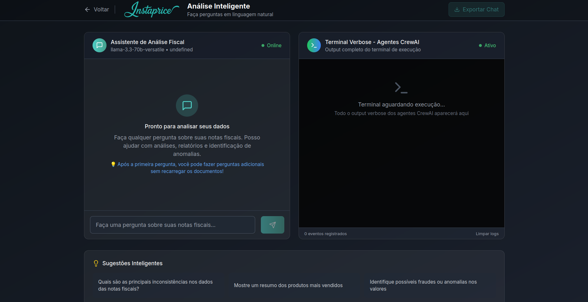

# 📦 Guia de Instalação - Hánotas

<div align="center">


**Sistema Inteligente de Análise Fiscal**  
*Guia completo de instalação e configuração*

</div>

---

## 📋 **Pré-requisitos**

### **Sistema Operacional**
- **Windows 10/11**, **macOS 10.15+**, ou **Linux (Ubuntu 20.04+)**
- **4GB RAM** mínimo (8GB recomendado)
- **2GB** de espaço livre em disco

### **Software Necessário**

| Software | Versão Mínima | Download |
|----------|---------------|----------|
| **Python** | 3.11+ | [python.org](https://python.org/downloads) |
| **Node.js** | 18+ | [nodejs.org](https://nodejs.org/download) |
| **Git** | 2.25+ | [git-scm.com](https://git-scm.com/downloads) |

### **Chave API**
- **Conta Groq**: [console.groq.com](https://console.groq.com)
- **API Key**: Gratuita com limite generoso

---

## 🚀 **Instalação Rápida (5 minutos)**

### **1. Clone o Repositório**
```bash
git clone https://github.com/forensicpython/Grupo-9---I2A2.git
cd Grupo-9---I2A2
```

### **2. Configure o Backend**
```bash
cd backend

# Instale as dependências
pip install -r requirements.txt

# Configure as variáveis de ambiente
cp .env.example .env

# Edite o arquivo .env e adicione sua GROQ_API_KEY
nano .env  # ou code .env no VS Code
```

### **3. Configure o Frontend**
```bash
cd ../frontend

# Instale as dependências
npm install
```

### **4. Execute o Sistema**
```bash
# Terminal 1 - Backend
cd backend
python server.py

# Terminal 2 - Frontend (nova aba/terminal)
cd frontend
npm run dev
```

### **5. Acesse o Sistema**
- **Frontend**: http://localhost:5173
- **Login**: Use "analista" ou contas de demonstração disponíveis
- **API Backend**: http://localhost:8000
- **Documentação API**: http://localhost:8000/docs

---

## 🔧 **Configuração Detalhada**

### **Configuração do Python**

#### **Verificar Versão**
```bash
python --version  # Deve ser 3.11+
python -m pip --version
```

#### **Criar Ambiente Virtual (Recomendado)**
```bash
cd backend

# Criar ambiente virtual
python -m venv venv

# Ativar ambiente virtual
# Windows:
venv\\Scripts\\activate
# macOS/Linux:
source venv/bin/activate

# Instalar dependências
pip install -r requirements.txt
```

### **Configuração do Node.js**

#### **Verificar Versão**
```bash
node --version  # Deve ser 18+
npm --version
```

#### **Instalar Dependências**
```bash
cd frontend
npm install

# Se houver problemas, limpe o cache:
npm cache clean --force
rm -rf node_modules package-lock.json
npm install
```

### **Configuração da API Groq**

#### **1. Criar Conta**
1. Acesse [console.groq.com](https://console.groq.com)
2. Crie uma conta gratuita
3. Confirme seu email

#### **2. Obter API Key**
1. No dashboard, clique em **"API Keys"**
2. Clique em **"Create API Key"**
3. Dê um nome (ex: "Hanotas")
4. Copie a chave gerada

#### **3. Configurar no Projeto**
```bash
cd backend

# Edite o arquivo .env
GROQ_API_KEY=sua_chave_aqui_colada
```

---

## 🐳 **Instalação com Docker (Opcional)**

### **Pré-requisitos**
- Docker 20.10+
- Docker Compose 2.0+

### **Executar com Docker**
```bash
# Clone o repositório
git clone https://github.com/seu-usuario/hanotas.git
cd Grupo-9---I2A2

# Configure a API key
cp backend/.env.example backend/.env
# Edite backend/.env e adicione sua GROQ_API_KEY

# Execute com Docker Compose
docker-compose up -d

# Acesse o sistema
# Frontend: http://localhost:5173
# Backend: http://localhost:8000
```

---

## 🧪 **Verificação da Instalação**

### **1. Teste o Backend**
```bash
cd backend
python server.py

# Em outro terminal:
curl http://localhost:8000/health
# Resposta esperada: {"status": "healthy"}
```

### **2. Teste o Frontend**
```bash
cd frontend
npm run dev

# Acesse http://localhost:5173
# Deve carregar a interface do Hánotas
```

#### **Tela de Login Elegante e Segura**


### **3. Teste da API Groq**

**Configuração da API:**
1. No frontend, acesse a seção "Configurações"
2. Insira sua chave API do Groq
3. Selecione o modelo desejado (recomendado: Qwen QWQ 32B)
4. Clique em "Testar Modelo Selecionado"
5. Deve mostrar "✅ Conexão bem-sucedida"

#### **Configuração Avançada de API Groq**


### **4. Teste de Upload**

**Como testar o upload de arquivos:**
1. Prepare um arquivo ZIP com CSVs de notas fiscais
2. Acesse a área de upload
3. Arraste e solte o arquivo ou clique para selecionar
4. Verifique se o arquivo é aceito (máximo 100MB)
5. Confirme se aparece na lista "Arquivos a Processar"

#### **Interface de Upload Intuitiva**


### **5. Teste Completo de Análise**

**Fluxo completo de teste:**
1. Faça upload de um arquivo ZIP com CSVs
2. Digite uma pergunta: "Quantas notas fiscais temos?"
3. Monitore o processamento no terminal
4. Acompanhe os logs dos agentes CrewAI
5. Verifique se recebe uma resposta detalhada
6. Teste as sugestões inteligentes automáticas

#### **Sistema de Análise Fiscal Inteligente**



---

## 🛠️ **Configurações Avançadas**

### **Configuração de Produção**

#### **Backend (.env)**
```bash
# Produção
DEBUG=false
LOG_LEVEL=INFO
HOST=0.0.0.0
PORT=8000

# Segurança
CORS_ORIGINS=["https://seu-dominio.com"]
ALLOWED_HOSTS=["seu-dominio.com"]

# Performance
MAX_TOKENS=4000
TEMPERATURE=0.1
ENABLE_CACHE=true
```

#### **Frontend (production build)**
```bash
cd frontend

# Build para produção
npm run build

# Preview da build
npm run preview

# Servir arquivos estáticos (Nginx/Apache)
cp -r dist/* /var/www/html/
```

### **Configuração de Modelos**

#### **Modelos Disponíveis**
```bash
# Modelo destacado na interface
MODEL=qwen-qwq-32b

# Rápido (padrão)
MODEL=llama-3.1-8b-instant

# Mais inteligente
MODEL=llama-3.3-70b-versatile  

# Contexto grande
MODEL=llama3-8b-8192
```

### **Configuração de Timeouts**

#### **Backend (.env)**
```bash
REQUEST_TIMEOUT=900    # 15 minutos
PROCESSING_TIMEOUT=900 # 15 minutos
```

#### **Frontend (config/timeouts.js)**
```javascript
export const TIMEOUTS = {
  API: {
    PROCESSING: 900000,  // 15 minutos
    UPLOAD: 120000,      // 2 minutos
  }
}
```

---

## 🔍 **Solução de Problemas**

### **Problemas Comuns**

#### **❌ Python não encontrado**
```bash
# Windows - Instale do Microsoft Store ou python.org
# macOS - Use Homebrew
brew install python@3.11

# Linux - Use o gerenciador de pacotes
sudo apt update
sudo apt install python3.11 python3.11-pip
```

#### **❌ Node.js não encontrado**
```bash
# Use o Node Version Manager (recomendado)
# Instale o nvm primeiro, depois:
nvm install 18
nvm use 18
```

#### **❌ Erro na instalação do Python**
```bash
# Erro comum: Microsoft Visual C++ 14.0 is required
# Solução: Instale o Build Tools for Visual Studio
# Download: https://visualstudio.microsoft.com/downloads/#build-tools-for-visual-studio-2022

# Ou use conda:
conda install python=3.11
```

#### **❌ Erro de permissão no npm**
```bash
# Configurar npm para não usar sudo
npm config set prefix ~/.npm-global
export PATH=~/.npm-global/bin:$PATH

# Ou use yarn:
npm install -g yarn
yarn install
```

### **Problemas de API**

#### **❌ GROQ_API_KEY inválida**
```bash
# Verifique se a chave está correta
echo $GROQ_API_KEY

# Teste manualmente
curl -H "Authorization: Bearer $GROQ_API_KEY" \
     https://api.groq.com/openai/v1/models
```

#### **❌ Rate limit exceeded**
```bash
# Aguarde alguns minutos
# Ou configure um delay entre requests no código
```

### **Problemas de Performance**

#### **❌ Processamento muito lento**
```bash
# Use modelo mais rápido
MODEL=llama-3.1-8b-instant

# Reduza o contexto
MAX_TOKENS=2000

# Ative cache
ENABLE_CACHE=true
```

#### **❌ Frontend não conecta ao backend**
```bash
# Verifique se o backend está rodando
curl http://localhost:8000/health

# Verifique CORS no backend
CORS_ORIGINS=["http://localhost:5173"]

# Verifique proxy no frontend (vite.config.js)
server: {
  proxy: {
    '/api': 'http://localhost:8000'
  }
}
```

---

## 📱 **Diferentes Ambientes**

### **Desenvolvimento Local**
```bash
# Backend
cd backend && python server.py

# Frontend
cd frontend && npm run dev

# Logs detalhados
VERBOSE_LOGS=true
DEBUG=true
```

### **Teste/Staging**
```bash
# Build otimizada
cd frontend && npm run build

# Servidor de produção
cd backend && python -m uvicorn server:app --host 0.0.0.0 --port 8000

# Configurações de teste
LOG_LEVEL=INFO
DEBUG=false
```

### **Produção**
```bash
# Use process manager (PM2)
npm install -g pm2

# Backend
pm2 start backend/server.py --name hanotas-backend

# Frontend (servir via Nginx)
cp -r frontend/dist/* /var/www/html/hanotas/
```

---

## 🔒 **Segurança**

### **Checklist de Segurança**
- [ ] **NUNCA** committar arquivos `.env`
- [ ] Usar HTTPS em produção
- [ ] Configurar CORS apropriadamente
- [ ] Validar todas as entradas
- [ ] Manter dependências atualizadas
- [ ] Configurar rate limiting
- [ ] Logs sem informações sensíveis

### **Atualizações**
```bash
# Backend
pip install -r requirements.txt --upgrade

# Frontend
npm update

# Verificar vulnerabilidades
npm audit
pip-audit
```

---

## 📞 **Suporte**

### **Central de Ajuda Integrada**

**O Hánotas possui uma central de ajuda completa acessível diretamente na interface:**

- **Início Rápido**: 6 passos visuais para começar
- **Sobre o Hánotas**: Descrição técnica completa
- **Agentes Inteligentes**: Detalhamento dos 7 agentes CrewAI
- **Como Funciona**: Fluxo de processamento explicado
- **Tecnologias**: CrewAI + Groq API + FastAPI

#### **Central de Ajuda Completa e Interativa**


### **Sobre Nossa Equipe**

**Conheça o Grupo 9 - Equipe multidisciplinar do desafio I2A2:**

- **Missão**: Desenvolver agentes inteligentes para análise fiscal
- **Tecnologias**: CrewAI, RAG, modelos avançados de IA
- **Contato**: Informações completas da equipe
- **Juliana**: Responsável principal do projeto

#### **Equipe Multidisciplinar - Grupo 9**


### **Recursos de Ajuda Externa**
- 📖 **Documentação**: [README.md](../README.md)
- 🐛 **Issues**: [GitHub Issues](https://github.com/forensicpython/Grupo-9---I2A2/issues)
- 💬 **Discussões**: [GitHub Discussions](https://github.com/forensicpython/Grupo-9---I2A2/discussions)
- 📧 **Email**: Entre em contato com a [equipe](../README.md#-equipe---grupo-9)

### **Logs Úteis**
```bash
# Backend logs
tail -f backend/logs/hanotas_*.log

# Frontend logs
# Abra DevTools (F12) -> Console

# Sistema logs
# Linux/macOS
journalctl -f

# Windows
# Event Viewer -> Application Logs
```

---

<div align="center">

### ✅ **Instalação Concluída!**

**Agora você pode usar o Hánotas para analisar suas notas fiscais com IA**

[](http://localhost:5173)

*Desenvolvido com ❤️ pelo Grupo 9*

</div>